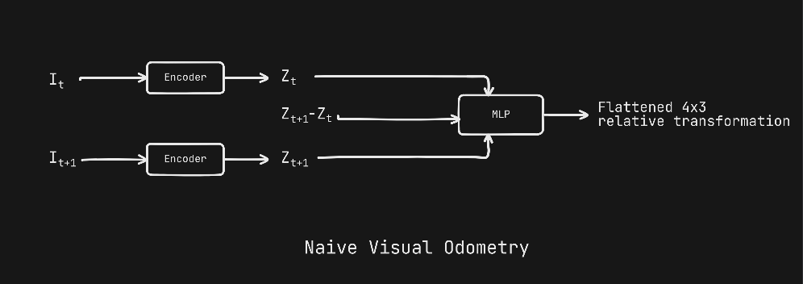
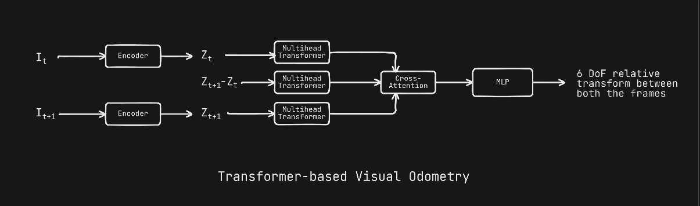

# Visual Odometry — Build Log

Incremental log of attempts at monocular visual odometry on KITTI: regressing the relative camera pose $T_{t \to t+1} \in SE(3)$ between two consecutive frames.

Target: flattened $3 \times 4$ pose (12 numbers), computed from `poses/<seq>.txt` as $T_{\text{rel}} = T_i^{-1} T_{i+1}$.

Dataset loader: [utils/KITTIOdometryDataset.py](utils/KITTIOdometryDataset.py). Sequence `00`, 80/20 random split, MSE loss, Adam @ `1e-3`.

---

## v0 — Patch-Encode + Concat + MLP (naive baseline)

Model in [main.py](main.py).

Idea: encode each frame into patch tokens with a single strided conv (ViT-style patch projection), concatenate the two encodings along the feature dim, mean-pool over patches, and regress with an MLP.

- Encoder: `Conv2d(3, EMBED_DIM, kernel=PATCH_SIZE, stride=PATCH_SIZE)` → `(B, N, D)`. Shared weights between frames.
- Head: `Linear(3D → H) → GELU → Linear(H → H) → GELU → Linear(H → 12)`.

Defaults: `EMBED_DIM=128`, `PATCH_SIZE=16`, `MLP_NODES=128`, batch 16, 10 epochs.

Known issues:

- Predicted $3 \times 4$ block is not constrained to $SE(3)$ (rotation not orthonormal).
- MSE on raw matrix entries mixes translation and rotation scales arbitrarily.
- No positional embeddings, no attention, no temporal context beyond a pair.
- Pose targets are unnormalized; consecutive-frame translations are tiny.
- Train and test come from the same sequence — no generalization signal.

---

## v1 — Transformer-based architecture



### _Not implemented yet_
---

## Setup

Python ≥ 3.12. With [uv](https://docs.astral.sh/uv/):

```bash
uv sync
source .venv/bin/activate
```

Edit the dataset `root` in [main.py](main.py) to point at your KITTI odometry directory, then:

```bash
python main.py
```

Expected dataset layout:

```
<root>/
├── sequences/00/image_2/   # 000000.png, 000001.png, ...
└── poses/00.txt            # one 3×4 row-major pose per line
```


### Patch Encoder

The encoder turns an image into a set of patch embeddings using a single strided convolution — equivalent to non-overlapping linear patch projection used in ViT:

- `Conv2d(3, EMBED_DIM, kernel_size=PATCH_SIZE, stride=PATCH_SIZE)`
- Output is reshaped to `(B, N_patches, EMBED_DIM)`.

The **same encoder weights** are shared between the two frames (Siamese-style).

### Hyperparameters (defaults in [main.py](main.py))

| Name         | Value | Meaning                              |
| ------------ | ----- | ------------------------------------ |
| `EMBED_DIM`  | 128   | Per-patch embedding dimension        |
| `PATCH_SIZE` | 16    | Patch side length in pixels          |
| `MLP_NODES`  | 128   | Hidden width of the regression head  |
| `OUT_DIM`    | 12    | Flattened 3×4 relative pose          |

---

## Dataset

[KITTI Odometry](https://www.cvlibs.net/datasets/kitti/eval_odometry.php). The loader is in [utils/KITTIOdometryDataset.py](utils/KITTIOdometryDataset.py).

Expected layout:

```
<root>/
├── sequences/
│   └── 00/
│       └── image_2/      # left color images: 000000.png, 000001.png, ...
└── poses/
    └── 00.txt            # one 3×4 row-major pose per line (cam-to-world)
```

For each index `i`, the dataset yields the consecutive pair $(I_i, I_{i+1})$ and computes the relative pose label as

$$
T_{\text{rel}} = T_i^{-1} \, T_{i+1}
$$

where $T_i, T_{i+1}$ are the absolute poses from `poses/<seq>.txt`. The top $3 \times 4$ block is flattened into a 12-vector used as the regression target.

Each sample is a dict:

```python
{
  "img1":   FloatTensor [3, H, W],
  "img2":   FloatTensor [3, H, W],
  "target": FloatTensor [12],   # flattened 3×4 relative pose
}
```


## Setup

Requires Python ≥ 3.12. Using [uv](https://docs.astral.sh/uv/):

```bash
uv sync
source .venv/bin/activate
```

Or with pip:

```bash
pip install "torch>=2.12.0" "torchvision>=0.27.0" "matplotlib>=3.10.9"
```

---

## Training

Edit the dataset `root` in [main.py](main.py) to point at your local KITTI odometry directory, then:

```bash
python main.py
```

Defaults:

- Optimizer: Adam, `lr = 1e-3`
- Loss: MSE on the 12-dim flattened pose vector
- Split: 80% train / 20% test, random split of sequence `00`
- Batch size: 16, Epochs: 10

A `transform` (e.g. `torchvision.transforms.Compose([Resize(...), ToTensor()])`) must be provided to the dataset to convert PIL images to tensors of a consistent size.

---

## Known Limitations

This is a **baseline**, not a competitive VO system:

- The MLP regresses pose components directly; the predicted $3 \times 4$ block is **not constrained to lie on $SE(3)$** (rotation part is not orthonormal).
- MSE on raw matrix entries weights translation and rotation arbitrarily.
- No positional embeddings, no self-attention, no temporal context beyond two frames.
- No data normalization of pose targets — translation magnitudes between consecutive KITTI frames are small, which can make the loss landscape ill-conditioned.
- Trains and evaluates on the same sequence (`00`); no cross-sequence generalization is measured.

These are intentional starting points for follow-up experiments (ViT encoder, $SO(3)$-aware loss, sequence models, etc.).
